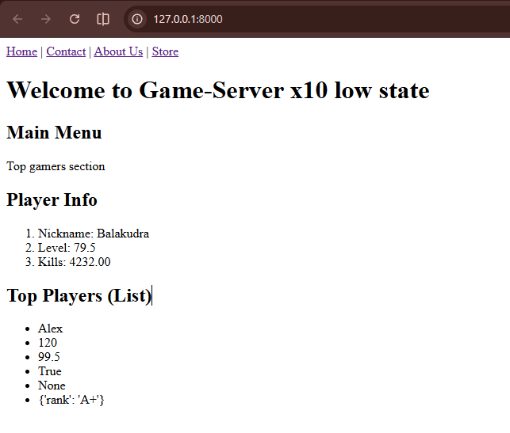
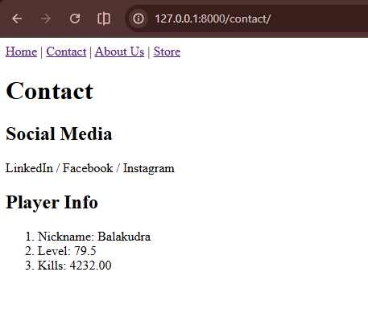
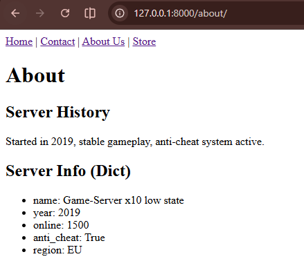
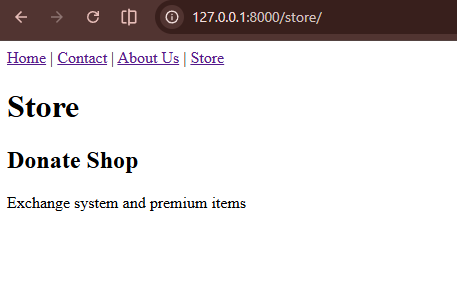

# Django Static Pages with no Templates

 Create 4 web pages with no style, each page should have the following tags:
        
 1. nav with anchor tags for every page, use | as separator
 2. h1
 3. h2
 4. p
   

Submit repo with markdown file with blocks of code for: 
* views.py
* urls.py
* settings.py (INSTALLED_APPS only)

Include screenshots for every page.

Use only django.http.HttpResponse, for every page add any of these data (include name and values for every element using f strings with ol or ul tags):

* 3 variables with different data types
* a list of mixed data types of length 6
* a dictionary with string keys and different data types values of length 5

## Exemple
### code

config/settings.py
```Python
# Application definition

INSTALLED_APPS = [
    'django.contrib.admin',
    'django.contrib.auth',
    'django.contrib.contenttypes',
    'django.contrib.sessions',
    'django.contrib.messages',
    'django.contrib.staticfiles',
    'static_pages_1',
]

```

config/urls.py
```Python
from django.urls import path
from static_pages_1 import views

urlpatterns = [
    path('', views.home),
    path('contact/', views.contact),
    path('about/', views.about),
    path('store/', views.store),
]

```


static_pages_1/views.py
```Python
from django.http import HttpResponse

nav = """
<nav>
    <a href='/'>Home</a> |
    <a href='/contact/'>Contact</a> |
    <a href='/about/'>About Us</a> |
    <a href='/store/'>Store</a>
</nav>
"""


nickname = "Balakudra"  
level = 79.5             
kills = 4232          

top_players = ["Alex", 120, 99.5, True, None, {"rank": "A+"}]


server_info = {
    "name": "Game-Server x10 low state",
    "year": 2019,
    "online": 1500,
    "anti_cheat": True,
    "region": "EU"
}


def render_variables():
    return f"""
    <h2>Player Info</h2>
    <ol>
        <li>Nickname: {nickname}</li>
        <li>Level: {level}</li>
        <li>Kills: {kills:.2f}</li>
    </ol>
    """

def render_list():
    items = "".join([f"<li>{i}</li>" for i in top_players])
    return f"""
    <h2>Top Players (List)</h2>
    <ul>
        {items}
    </ul>
    """

def render_dict():
    items = "".join([f"<li>{k}: {v}</li>" for k, v in server_info.items()])
    return f"""
    <h2>Server Info (Dict)</h2>
    <ul>
        {items}
    </ul>
    """

def home(request):
    content = """
    <h1>Welcome to Game-Server x10 low state</h1>
    <h2>Main Menu</h2>
    <p>Top gamers section</p>
    """
    return HttpResponse(nav + content + render_variables() + render_list())


def contact(request):
    content = """
    <h1>Contact</h1>
    <h2>Social Media</h2>
    <p>LinkedIn / Facebook / Instagram</p>
    """
    return HttpResponse(nav + content + render_variables())


def about(request):
    content = """
    <h1>About</h1>
    <h2>Server History</h2>
    <p>Started in 2019, stable gameplay, anti-cheat system active.</p>
    """
    return HttpResponse(nav + content + render_dict())


def store(request):
    content = """
    <h1>Store</h1>
    <h2>Donate Shop</h2>
    <p>Exchange system and premium items</p>
    """
    return HttpResponse(nav + content)
```

### Rendering
## Screenshots

### Home Page


### Contact Page


### About Page


### Store Page

